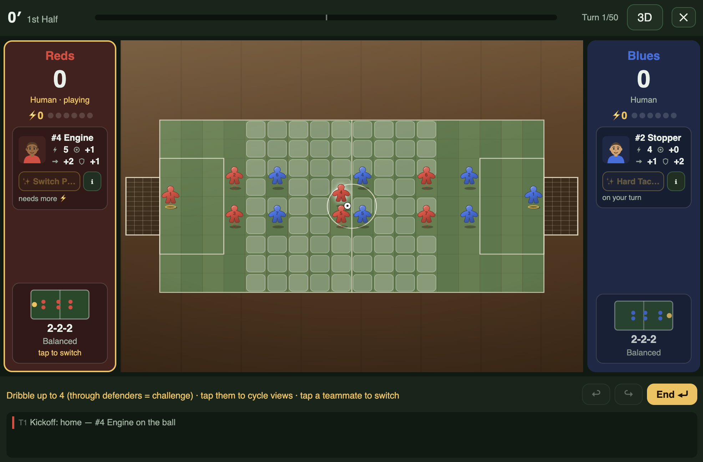

# ⚽ Grid Soccer

A turn-based soccer board game as a standalone PWA: 9×18 pitch, formation
cards, RPG-style stats, and 2d6 dice for every contested moment. Plays
offline, installs to a home screen, and converts to pencil & paper.

**Play it: <https://method-run.github.io/idk-soccer/>**



## Run it

Any static file server works (service workers need localhost or https):

```sh
python3 -m http.server 8321
# open http://localhost:8321
```

Tests (pure rules engine + 20 seeded AI-vs-AI matches):

```sh
npm test
```

## Modes

- **Draft** (optional toggle, on by default for PvE/PvP) — both sides pick
  7 footballers (1 GK + 6) from a shared 28-player pool in snake order,
  then arrange them into formation slots before kickoff. Drafted stars
  carry unique charge-powered abilities (see How to play in-game).
- **vs Computer** — you are the Reds, a heuristic AI plays the Blues.
- **2 Players** — hotseat on one device; the defender picks keeper dives
  on the on-field goal (honor system: don't watch the aim too closely).
- **Watch · CPU vs CPU** — spectator mode with a 1×/2×/4× speed toggle;
  handy for eyeballing balance changes.

## The rules in one breath

Each turn: optionally switch your formation card (your team panel shows it;
drift arrows preview the auto-moves), pick one footballer to control
(defaults to the carrier / closest to the ball), move them, take one ball
action from the ring around them (pass / shoot / steal — with odds), and end
your turn — everyone else drifts one square toward their formation slot.
Undo/redo freely until you end your turn. All rolls are **2d6 + stat vs a
target number**, resolved with a center-screen dice cinematic. Shots aim at
one of 6 goal cells; the keeper commits to a dive blind.
Full rules: the in-game **How to play** screen.

## Project layout

- `js/game.js` — pure rules engine (no DOM, injectable dice)
- `js/ai.js` — heuristic opponent
- `js/render.js` — SVG board renderer
- `js/main.js` — screens, interaction state machine, AI turn driver
- `js/data.js` — rosters, formation cards, board constants
- `docs/plans/` — design docs, including deliberate v1 gambles to playtest

## Paper conversion

9×18 grid, 14 coins (write SPD/SHO/PAS/CTL on stickers), a ball token,
2 six-sided dice. Target numbers are in the How-to-play screen. Random
scatter direction: roll a d8 or spin a pencil.
